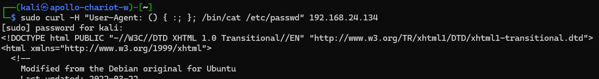

# role block-shellshock-attempt

Wazuh proof of concept to block Shellshock attempts

This role will:
- enable module `firewall-drop` in the **wazuh manager**
  - restart **wazuh manager** service
- install Apache web server in **wazuh agent**
- add apache logs to **wazuh agent**
  - restart **wazuh agent** service
- add active response to block Shellshock attempt
  - restart **wazuh manager** service

## usage

Go to the root of the repo and run the following command

```bash
ANSIBLE_CONFIG=./ansible.cfg ansible-playbook ./playbooks/block-shellshock-attempt.yaml
```

## Testing Shellshock blocking

You will need `curl` to run an Shellshock attack

```bash
sudo curl -H "User-Agent: () { :; }; /bin/cat /etc/passwd" <WEBSERVER_IP_ADDRESS>
```

example

```bash
sudo curl -H "User-Agent: () { :; }; /bin/cat /etc/passwd" 192.168.24.134
```

After running the command, Wazuh will block the offending IP for 3 minutes to stop further attempts of Shellshock.

Shellshock attempt



Wazuh dashboard blocking Shellshock attempt


## References

- https://documentation.wazuh.com/current/proof-of-concept-guide/detect-web-attack-shellshock.html
