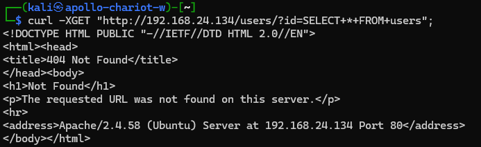
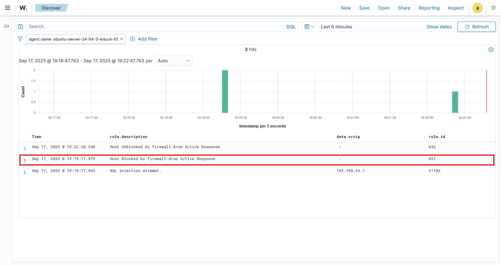

# role block-sql-injection

Wazuh proof of concept to block SQL injection attempts

This role will:
- enable module `firewall-drop` in the **wazuh manager**
  - restart **wazuh manager** service
- install Apache web server in **wazuh agent**
- add apache logs to **wazuh agent**
  - restart **wazuh agent** service
- add active response to block SQL injection attempt
  - restart **wazuh manager** service

## usage

Go to the root of the repo and run the following command

```bash
ANSIBLE_CONFIG=./ansible.cfg ansible-playbook ./playbooks/block-sql-injection.yaml
```

## Testing SQL injection blocking

You will need `curl` to run an SQL injection attack

Run the following command

```bash
curl -XGET "http://<UBUNTU_IP>/users/?id=SELECT+*+FROM+users";
```

Example


```bash
curl -XGET "http://192.168.24.134/users/?id=SELECT+*+FROM+users";
```

After running the command, Wazuh will block the offending IP for 3 minutes to stop further attempts of SQL injection.

SQL injection attempt



Wazuh dashboard blocking SQL injection attempt



## References

- https://documentation.wazuh.com/current/proof-of-concept-guide/detect-web-attack-sql-injection.html
