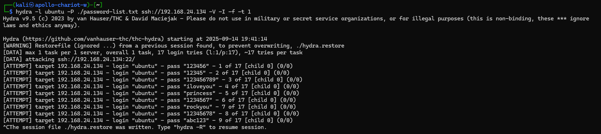
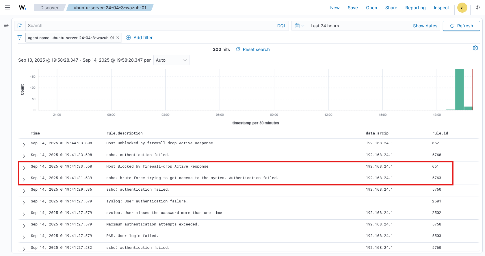

# role block-ssh-brute-force

Wazuh proof of concept to block SSH brute force attempts

This role will modify the wazuh manager to
- enable module `firewall-drop`
- run active response when multiple failed SSH attempts have been made
- restart **wazuh manager** service

## usage

Go to the root of the repo and run the following command

```bash
ANSIBLE_CONFIG=./ansible.cfg ansible-playbook ./playbooks/block-ssh-brute-force.yaml
```

## Testing SSH brute force blocking

You will need `hydra` to run brute force attack

This command will be using a small password list file `password-list.txt`

```txt
123456
12345
123456789
iloveyou
princess
1234567
rockyou
12345678
abc123
nicole
daniel
babygirl
monkey
lovely
jessica
654321
password
```

You can also use the RockYou password list from `/usr/share/wordlists/rockyou.txt.gz` if running hydra command from **Kali linux**

Run the following command. **NOTE**: replace the password list file and IP address to your wazuh-manager

```bash
hydra -l <username> -P <password list file> ssh://<IP address> -V -I -f -t 1
```

Example

```bash
hydra -l ubuntu -P ./password-list.txt ssh://192.168.24.134 -V -I -f -t 1
```

- `hydra`: application for running brute force attack
- `-l` : provide target username
- `<username>` : username of the target
- `-P` : use a password list text file
- `<password list file>` : password list text file
- `ssh://<IP address>` : target IP address and using SSH
- `-V` : display every attempt
- `-I` : ignore previous hydra command attempts
- `-f` : exit after the correct login credentials is found
- `-t 1` : attempt SSH login one at a time

SSH brute force attempt


Wazuh dashboard blocking brute force attempt


## References

- https://documentation.wazuh.com/current/user-manual/capabilities/active-response/ar-use-cases/blocking-ssh-brute-force.html
- https://wazuh.com/blog/blocking-attacks-active-response/
