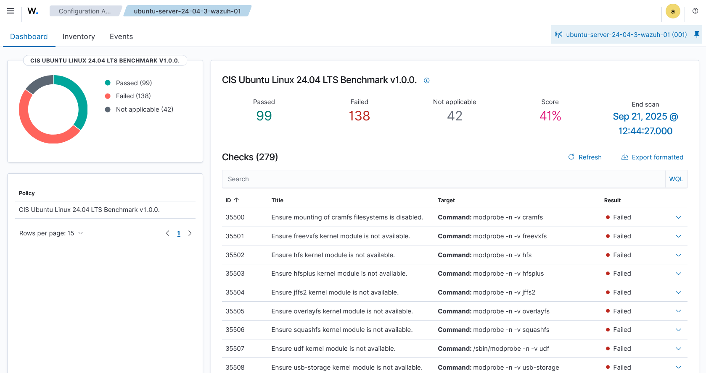

# role cis-benchmark

Implementing CIS benchmark for Ubuntu

This role will
- run all task files in this role

## usage

Go to the root of the repo and run the following command

```bash
ANSIBLE_CONFIG=./ansible.cfg ansible-playbook ./playbooks/cis-benchmark.yaml
```

## Testing CIS benchmarks

Wazuh has a section called `Configuration assessment`.
This section compares which CIS benchmark configs have been implemented and which ones have not.

After running the playbook, the number of passed CIS benchmarks will increase

### Before



### After


## References

- https://downloads.cisecurity.org/#/
- https://learn.cisecurity.org/l/799323/2025-06-10/4vddgt
  - Ubuntu 24.04 LTS
