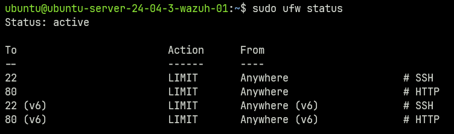

# role ufw

Adding firewall rules on wazuh agent

This role will:
- install ufw on Debian based systems
- allow outgoing traffic by default
- block incoming traffic by default
- allow port numbers using a var list located in `./vars/ufw.yaml`
- enable ufw

## usage

```bash
ANSIBLE_CONFIG=./ansible.cfg ansible-playbook ./playbooks/ufw.yaml
```
## Testing UFW firewall rules

After running the role, you can check the firewall rule status in wazuh agent using the following command

```bash
sudo ufw status
```


